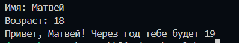
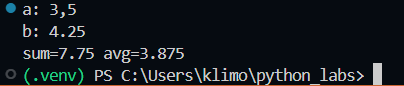
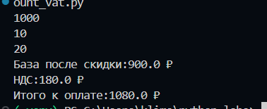
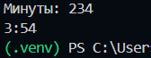
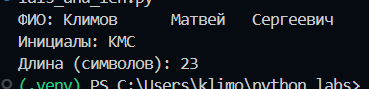
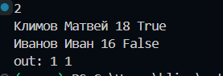
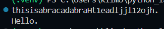
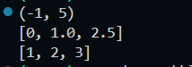
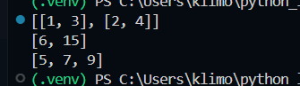
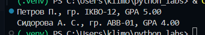

## Лабораторная работа 1

### Задание 1
```python
name = str(input('Имя: '))
age = int(input('Возраст: '))
print("Привет,", name + '!', 'Через год тебе будет', age + 1)
```


### Задание 2
```python
num1 = float(input('a: ').replace(',', '.'))
num2 = float(input('b: ').replace(',', '.'))
summa = num1 + num2
srednee = (num1 + num2) / 2
print('sum='+ str(summa), 'avg=' + str(srednee))
```


### Задание 3
```python
price = int(input())
discount = float(input())
vat = float(input())
base = price * (1 - discount/100)
vat_amount = base * (vat/100)
print('База после скидки:' + str(base) + ' ₽')
print('НДС:' + str(base * (vat/100)) + ' ₽')
print('Итого к оплате:' + str(base + vat_amount) + ' ₽')
```


### Задание 4
```python
minutes = int(input('Минуты: '))
a = minutes // 60
b = minutes - a*60
print(f'{a}:{b:02d}')
```


### Задание 5
```python
fio = str(input('ФИО: '))
lenfio = len(fio.replace(' ', ''))
fio = fio.split()
f = fio[0][0]
i = fio[1][0]
o = fio[2][0]
print('Инициалы:', str(f) + str(i) + str(o))
print('Длина (символов):', lenfio + 2)
```


### Задание 6
```python
n = int(input())
ochnoe = 0
zaochnoe = 0
for i in range(n):
    info = str(input())
    info = info.split()
    if info.count("True") >= 1:
        ochnoe += 1
    else:
        zaochnoe += 1
print("out:", ochnoe, zaochnoe)
```


### Задание 7
```python
trash = str(input())
word= ''
counter = -1
trash = list(trash)
for i in trash:
    counter += 1
    if i in "ABCDEFGHIJKLMNOPQRSTUVWXYZ":
        word += i
        break
trash = trash[counter:]
counter = -1
for j in trash:
    counter += 1
    if j in "0123456789":
        word += trash[counter + 1]
        break
trash = trash[::counter + 1]
trash = "".join(trash)
print(trash)

```

<<<<<<< HEAD

## Лабораторная работа 2

### Задание 1
```python
def min_max(numlist):
    max_num = max(numlist)
    min_num = min(numlist)
    min_max = (min_num, max_num)
    return min_max

def unique_sorted(numlist):
    sort_num_list = sorted(set(numlist))
    return sort_num_list

def flatten(tuple_num_list):
    massiv_num_list = []
    for numlist in tuple_num_list:
        if isinstance(numlist, (list, tuple)):
            for num in numlist:
                massiv_num_list.append(num)
        else:
            raise TypeError
    return massiv_num_list

n1 = [3, -1, 5, 5, 0]
n2 = [1.0, 1, 2.5, 2.5, 0]
n3 = [[1], [], [2, 3]]

print(min_max(n1))
print(unique_sorted(n2))
print(flatten(n3))
```


### Задание 2
```python
def transpose(numlist):
    final_result = []
    for num in range(len(numlist) - 1):
        if len(numlist[num]) != len(numlist[num + 1]):
            raise ValueError
    if numlist == []:
        return []
    cols = len(numlist)
    rows = len(numlist[0])
    for i in range(rows):
        inter_result = []
        for j in range(cols):
            inter_result.append(numlist[j][i])
        final_result.append(inter_result)
    return final_result

def unique_sorted(numlist):
    final_result = []
    for num in range(len(numlist) - 1):
        if len(numlist[num]) == len(numlist[num + 1]):
            final_result.append(sum(numlist[num]))
        else:
            raise ValueError
    final_result.append(sum(numlist[-1]))
    return final_result

def col_sums(numlist):
    final_result = []
    alt_final_result = []
    if len(numlist) == 1:
        alt_final_result.append(numlist[0][0])
        return alt_final_result
    else:
        for num in range(len(numlist) - 1):
            if len(numlist[num]) == len(numlist[num + 1]):
                for i in range(len(numlist[0])):
                    final_result.append(numlist[num][i] + numlist[num + 1][i])
            else:
                raise ValueError
        return final_result

n1 = [[1, 2], [3, 4]]
n2 = [[1, 2, 3], [4, 5, 6]]
n3 = [[1, 2, 3], [4, 5, 6]]

print(transpose(n1))
print(unique_sorted(n2))
print(col_sums(n3))
```


### Задание 3
```python
def format_record(info):
    fio = info[0]
    group = info[1]
    gpa = info[2]
    fio = fio.split()
    if len(fio) == 3:
        fio[0] = fio[0][0].upper() + fio[0][1:] 
        fio[1] = fio[1][0].upper() + '.'
        fio[2] = fio[2][0].upper() + '.'
        fio = " ".join(fio)
    else: 
        fio[0] = fio[0][0].upper() + fio[0][1:] 
        fio[1] = fio[1][0].upper() + '.'
        fio = " ".join(fio)
    group = 'гр. ' + group
    gpa = "GPA " + str(round(gpa, 2)) + '0'
    return str(fio + ", " + group + ", " + gpa)

info = ("Петров Пётр", "IKBO-12", 5.0)
info2 = ("  сидорова  анна   сергеевна ", "ABB-01", 3.999)
print(format_record(info))
print(format_record(info2))
```

=======
>>>>>>> f821e284b7105a0c377adfa5883b716d4757275d


